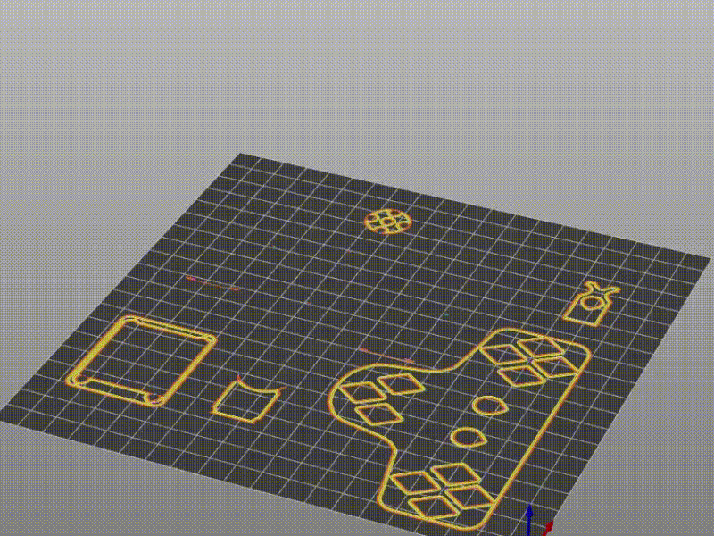
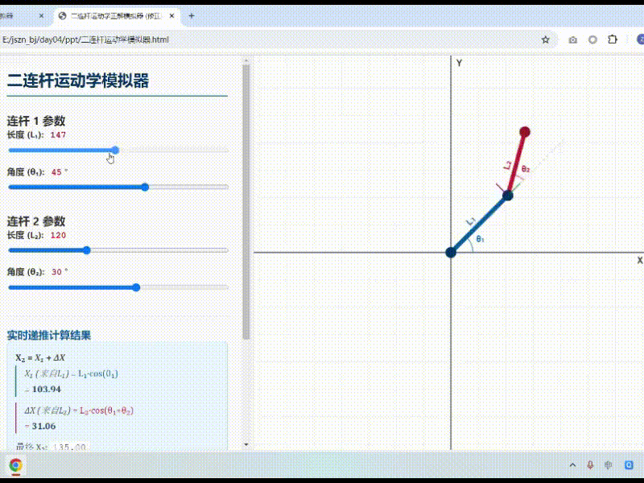
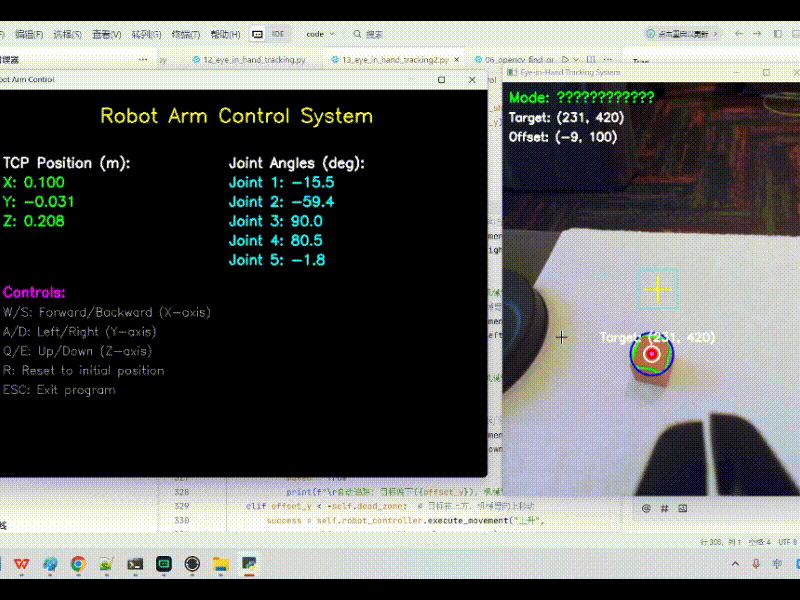
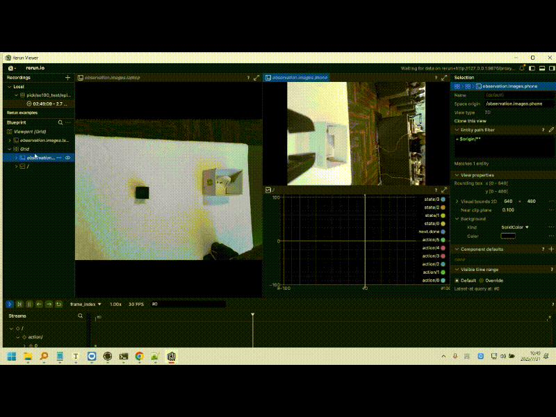

# 黑马程序员 · 具身智能课程大纲

## 🚀 AI的下一个奇点：从虚拟走向现实

当ChatGPT已经能为你写诗、作画、编程时，你是否想过，AI的下一步将走向何方？

答案是：**具身智能 (Embodied Intelligence)**。

我们不再满足于让AI在云端思考，我们要让它拥有身体，去感知、去行动、去与我们真实的世界交互。这，是通往通用人工智能（AGI）的必由之路，也是2025年最值得你投资的技术赛道。

如果你感到职业瓶颈，渴望一次技术跃迁；如果你不甘于只做“调包侠”和“提示词工程师”，渴望真正创造一个“活”的智能体。那么，这门课程就是为你设计的。

## 💡 课程理念：用对话定义未来！

> AI时代，Code is cheap, show me your talk.

在这门课里，我们将颠覆传统的编程学习方式。所有程序编码将优先采用AI提示词生成！你将成为真正的“AI项目经理”，学习最前沿的提示词编程，用自然语言指挥AI生成和优化代码，将重心放在系统设计与创新，而非埋头于语法细节。

## 🤖 核心目标：8天，亲手创造一个“AI生命”

我们拒绝纸上谈兵。整个课程将围绕一个核心目标：**亲手打造一个能听、能看、能动、能模仿、能自主学习的桌面级AI机械臂。**

---

## 课程学习路径

### 🦾 第一阶段：铸其筋骨——为AI赋予实体

我们将从最基础的物理结构开始，让你对机器人的“身体”有最直观的认识。从零开始，亲手组装，感受每一个零件如何协同工作。

**你将学到：**

- **核心驱动原理**：深入理解舵机、步进电机和无刷电机的工作方式。
- **机械结构设计**：学习减速齿轮如何提升扭矩，以及3D结构的设计与打印入门。
- **感知与反馈**：掌握角度传感器与编码器的原理，为精准控制打下基础。

**最终成果：一台由你亲手组装、结构完整的机械臂原型。**

### ⚡ 第二阶段：通其经脉——让机器人精准驱动

有了身体，如何让它动起来？我们将深入“运动”的核心，连接虚拟与现实，用代码赋予它灵魂的节拍。

**你将学到：**

- **虚拟仿真**：掌握URDF机器人建模语言，在虚拟环境中调试你的机械臂。
- **底层通讯**：建立上位机与下位机的高效通讯，打通控制链路。
- **核心运动学**：精通正向运动学（FK）与逆向运动学（IK）的原理与代码实现。
- **精准控制**：学习PID闭环控制算法，让机械臂的动作更稳、更准。
- **远程遥操作**：实现对真实机械臂的远程同步控制。

**最终成果：像玩游戏一样精准控制真实机械臂，完成远程抓取。**

### 🧠 第三阶段：点其心智——装上眼睛和大脑

这是最激动人心的部分！让它从“听话的工具”变成“会思考的伙伴”。我们将为机械臂装上眼睛和大脑，让它能理解世界，并做出决策。

**你将学到：**

- **计算机视觉**：基于OpenCV进行图像处理、颜色与形状识别、目标追踪。
- **深度学习应用**：使用YOLO框架进行实时目标检测，并训练自己的检测模型。
- **多模态交互**：集成语音识别（ASR）和语音合成（TTS），实现与机械臂的语音对话。
- **手眼标定**：建立视觉空间与物理空间的联系，实现精准抓取。
- **本地大模型**：部署本地大语言模型（如Deepseek），并将其接入控制系统，实现基于自然语言的任务理解与执行。

**最终成果：一个能识别物体、听懂语音、由大模型驱动决策的智能机械臂。**

### ✨ 第四阶段：授其神髓——让机器人自主进化

通往AGI的终极奥秘！我们将带你进入“行为克隆”与“强化学习”的前沿领域，让你的机器人拥有自主学习和进化的能力。

**你将学到：**

- **行为克隆 (BC)**：学习模仿学习的核心思想，录制专家数据，克隆你的操作。
- **强化学习 (RL)**：掌握Q-learning、DQN等核心概念，通过奖励与惩罚，让机械臂在探索中自主学习最优策略。
- **开源项目实践**：基于斯坦福ALOHA等前沿开源项目，进行源码级的学习与实践。

**最终成果：你演示，它学习！机械臂能够自主模仿并优化你的任务。**

---

## 🎯 这门课，为这样的你准备

- **AI/算法工程师**：希望突破LLM的边界，将算法能力延伸至物理世界。
- **嵌入式/机器人工程师**：希望为你的硬件产品注入真正的“智能”与“灵魂”。
- **计算机专业的学生**：希望构建差异化竞争力，为简历添上浓墨重彩的一笔。
- **对前沿科技充满热情的极客**：渴望亲手创造属于自己的AI机器人。

---

## 📚 详细课程目录

点击展开查看全部223节课程

- 001_具身智能概念介绍.mp4
- 002_具身智能的体系架构.mp4
- 003_具身智能的四大挑战.mp4
- 004_具身智能课题和科研方向.mp4
- 005_产业展示.mp4
- 006_舵机工作原理介绍.mp4
- 007_步进电机和无刷电机的介绍.mp4
- 008_减速齿轮提升扭矩.mp4
- 009_阻尼齿轮介绍.mp4
- 010_角度传感器的介绍.mp4
- 011_3d结构的设计和打印.mp4
- 012_编码器舵机的设计.mp4
- 013_虚拟仿真概念介绍.mp4
- 014_虚拟仿真的优缺点.mp4
- 015_URDF概念介绍.mp4
- 016_link和joint的概念.mp4
- 017_link的模型描述.mp4
- 018_urdf链接方式介绍.mp4
- 019_LINK标签子元素详解.mp4
- 020_urdf的link语法介绍.mp4
- 021_nodejs介绍和安装.mp4
- 022_nodejs仿真环境测试.mp4
- 023_构建机械臂的base组件.mp4
- 024_构建机械臂的第一个joint.mp4
- 025_构建机械臂的其他的joint和link.mp4
- 026_urdf仿真创建的细节问题.mp4
- 027_上下位机通讯流程.mp4
- 028_扫描配置编码器舵机.mp4
- 029_获取某个编号id的角度.mp4
- 030_多个舵机角度的获取.mp4
- 031_pip的依赖安装.mp4
- 032_今日课程目标介绍.mp4
- 033_miniconda的安装.mp4
- 034_conda的常用指令.mp4
- 035_conda的环境搭建.mp4
- 036_安装细节介绍.mp4
- 037_教师端机械臂为什么要标定.mp4
- 038_舵机标点的数据展示.mp4
- 039_舵机标定的算法原理.mp4
- 040_要操作相关概念介绍.mp4
- 041_编程语言发展趋势.mp4
- 042_teacher端机械臂的标定完成.mp4
- 043_ai编写一个舵机角度监控的程序.mp4
- 044_为网页代码添加websocket的逻辑.mp4
- 045_websocket的调试.mp4
- 046_完成python端和web端的数据通讯.mp4
- 047_读取真实机械臂的角度.mp4
- 048_修复模拟器显示的小bug.mp4
- 049_苹果公司机械臂实现原理.mp4
- 050_动作序列的录制和回放.mp4
- 051_机器人运动学概念介绍.mp4
- 052_一级运动学模型介绍.mp4
- 053_多连杆运动学的解析.mp4
- 054_矩阵运算原理介绍.mp4
- 055_矩阵运动学末端的求解.mp4
- 056_3维空间的运动学求解.mp4
- 057_旋转平移矩阵的代码验证.mp4
- 058_逆运动学多解性.mp4
- 059_逆运动学的其他难题.mp4
- 060_逆向运动学的求解方法.mp4
- 061_几何法求解逆运动学代码演示.mp4
- 062_数值法求解的优缺点.mp4
- 063_运动学逆解的应用场景分析.mp4
- 064_正逆运动学代码展示.mp4
- 065_让ai帮我生成键盘控制代码.mp4
- 066_机械臂的反解控制逻辑的实现.mp4
- 067_机械臂反解和正解的代码是如何创建的.mp4
- 068_控制论-开环系统.mp4
- 069_控制论-闭环系统.mp4
- 070_PID算法概述.mp4
- 071_PID算法模拟器.mp4
- 072_PID参数讲解.mp4
- 073_PID算法总结.mp4
- 074_设置每个电机的id和最高电压.mp4
- 075_学生端的中位校准标定（重要）.mp4
- 076_学生端标定的验证.mp4
- 077_学生端角度的控制代码.mp4
- 078_千万不要在使能状态下扭动机械臂.mp4
- 079_机械臂的遥操作.mp4
- 080_机械臂PID的调整.mp4
- 081_相关任务介绍.mp4
- 082_计算机视觉简介.mp4
- 083_计算机保存彩色图片的原理.mp4
- 084_opencv概念介绍.mp4
- 085_opencv的helloworld代码.mp4
- 086_opencv打开摄像头画面.mp4
- 087_opencv的roi操作.mp4
- 088_颜色分拣器的需求分析.mp4
- 089_颜色分拣器的代码开发.mp4
- 090_做一个灰色hsv范围的提取器.mp4
- 091_添加一个均值滤波提升检测的稳定性.mp4
- 092_为什么需要手眼标定.mp4
- 093_像素空间和物理空间的比例尺.mp4
- 094_基于像素空间和物理空间的比例计算物体大小.mp4
- 095_采集机械臂抓取的角度信息.mp4
- 096_机械臂的正解和反解的示例代码.mp4
- 097_控制机械臂运动的代码.mp4
- 098_通过正解公式得到物理世界的坐标.mp4
- 099_运动学逆解的求解流程.mp4
- 100_形状侦测逻辑的实现.mp4
- 101_利用差值算法来识别新增的物体.mp4
- 102_opencv追踪一个颜色块的移动.mp4
- 103_红色瓶盖追踪算法的优化.mp4
- 104_眼在手上摄像头的介绍.mp4
- 105_眼在手上摄像头方向的修正.mp4
- 106_调整红色瓶盖的hsv值.mp4
- 107_机械臂跟随控制的核心逻辑.mp4
- 108_机械臂运动控制的联调.mp4
- 109_鸟瞰图仿射变换.mp4
- 110_获取被抓取物体的姿态角度信息.mp4
- 111_opencv二维码识别.mp4
- 112_opencv人脸检测的逻辑实现.mp4
- 113_opencv的情绪识别.mp4
- 114_零件计数识别.mp4
- 115_传统机器视觉的缺陷.mp4
- 116_机器学习概念入门.mp4
- 117_机器学习深度学习的概念.mp4
- 118_机器学习的目标.mp4
- 119_机器学习常见术语介绍.mp4
- 120_机器学习的feature和label.mp4
- 121_数据集的划分_训练集和测试集.mp4
- 122_机器学习概念的分类.mp4
- 123_机器学习的建模流程.mp4
- 124_特征工程概念介绍.mp4
- 125_回归函数的最小均方差MSE.mp4
- 126_梯度下降的学习速率参数.mp4
- 127_分类任务的原理.mp4
- 128_交叉熵概念介绍.mp4
- 129_sklearn线性回归简单演示.mp4
- 130_一个线性模型不能解决异或问题.mp4
- 131_oxr数据的解析.mp4
- 132_演示特征工程和复杂神经网络的组拼.mp4
- 133_手写数字识别的数据集展示.mp4
- 134_mnist数据集的加载与观察.mp4
- 135_115301.mp4
- 136_神经网络的训练和模型保存.mp4
- 137_利用opencv捕获手写数字.mp4
- 138_摄像头捕获数据的预处理.mp4
- 139_手写数字识别的推理流程.mp4
- 140_手写数字综合案例设计.mp4
- 141_混淆矩阵的概念.mp4
- 142_查全率和召回率和F1分数.mp4
- 143_yolo框架的安装.mp4
- 144_yolo框架的推理演示.mp4
- 145_yolo模型的使用说明.mp4
- 146_数据标注的要求说明.mp4
- 147_标注口罩和非口罩数据.mp4
- 148_yolo标签数据的转化.mp4
- 149_准备yolo训练的数据集.mp4
- 150_yolo训练的配置文件.mp4
- 151_yolo训练过程的演示.mp4
- 152_yolo推理效果的展示.mp4
- 153_CNN卷积入门.mp4
- 154_卷积核的工作原理.mp4
- 155_卷积神经网络的池化和打平操作.mp4
- 156_数据收集需求分析.mp4
- 157_构造一个识别的透明图片.mp4
- 158_图像素材和标注信息生成原理.mp4
- 159_生成标注信息和标注的图像.mp4
- 160_yolo训练的启动.mp4
- 161_音频录制的代码.mp4
- 162_音频转文本的操作.mp4
- 163_天猫精灵基于规则的语音对答.mp4
- 164_yolo识别画面的部署展示.mp4
- 165_语音聊天系统的简单实现.mp4
- 166_文本转语音tts合成技术.mp4
- 167_语音对话的全流程展示.mp4
- 168_对接大模型的语音开发.mp4
- 169_当前聊天流程的缺陷.mp4
- 170_访问文件异常的解决方案.mp4
- 171_大模型相关的概念.mp4
- 172_大模型工作的底层原理.mp4
- 173_deepseek大模型的介绍.mp4
- 174_Deepseek裁剪和蒸馏模型的介绍.mp4
- 175_ollama框架的安装.mp4
- 176_ollama的模型加载.mp4
- 177_ollama的一些常见命令.mp4
- 178_大模型超级参数的调整.mp4
- 179_chatbox的安装和使用.mp4
- 180_代码与ollama交互实现大语言模型聊天.mp4
- 181_开发一个交互的网页聊天助手.mp4
- 182_带有GUI版本的黑马聊天助手.mp4
- 183_MCP模型上下文协议的介绍.mp4
- 184_MCP客户端服务器交互的流程.mp4
- 185_让大模型拥有控制物理世界设备的能力.mp4
- 186_mcp服务器控制真实的硬件.mp4
- 187_目标效果展示.mp4
- 188_斯坦福aloha机器人的介绍.mp4
- 189_端到端行为克隆技术的演示.mp4
- 190_强化学习和行为克隆概念介绍.mp4
- 191_版本控制软件GIT的安装.mp4
- 192_genkiarm源码下载和安装.mp4
- 193_完成开源项目config设备的配置.mp4
- 194_安装代理设置.mp4
- 195_非常重要非常重要teacher端标定.mp4
- 196_非常重要，检查teacher和student的角度标定.mp4
- 197_遥操作检查.mp4
- 198_数据集的录制操作.mp4
- 199_查看录制数据集的操作.mp4
- 200_录制动作回放操作.mp4
- 201_行为克隆效果展示.mp4
- 202_采集数据的注意事项.mp4
- 203_本地电脑训练的流程.mp4
- 204_云服务器训练模型的流程.mp4
- 205_云服务器的nohup指令.mp4
- 206_下载服务器上训练好的模型.mp4
- 207_修改服务器的防火墙端口号.mp4
- 208_强化学习的5大概念.mp4
- 209_强化学习的概念分分析.mp4
- 210_mdp状态转移模型.mp4
- 211_mdp和强化学习的关系.mp4
- 212_强化学习环境gym的安装.mp4
- 213_强化学习冰冻湖环境演示.mp4
- 214_冰冻湖随机移动的效果展示.mp4
- 215_初始化强化学习的q表.mp4
- 216_q表数据更新的原理.mp4
- 217_Q表奖励的传递更新.mp4
- 218_qlearning强化学习的最终代码.mp4
- 219_dqn强化学习简介.mp4
- 220_qtalbe的可视化训练过程.mp4
- 221_huggingface模型网站介绍.mp4
- 222_huggingface文生图.mp4
- 223_遗传神经网络的介绍.mp4

